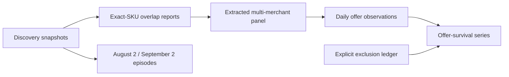

# SKU, offer, and episode field guide

Data cutoff: **2026-09-16**. This note covers every SKU-level discovery snapshot,
extracted panel, and daily panel observation currently stored in `data/ucp`.

## Main findings

- The discovery and panel files contain **323,487 distinct literal SKU strings**.
- **41,808** SKU strings appeared under at least two independent company domains in a
  single discovery or panel run.
- The widest literal match reached **14 merchants**, but most of the widest values
  are generic identifiers such as `GC-25` or `NVDPROTECTION0`, not reliable global
  product identifiers.
- The unfiltered August 2 to September 2 construction produced 294 episodes. The
  paper now uses **192 high-confidence episodes**: 94 tuning and 98 held out. The
  medium-confidence sensitivity set contains 243 episodes, with 123 held out.
- Through September 15, the daily panel recorded **1,864 unique merchant-offer
  losses across 1,598 SKUs** and 1,870 present-to-gone transition events. No SKU
  lost offers from more than two raw merchant domains in this confirmed window.
- A full September 16 rerun produced 8,126 apparent merchant-offer losses across
  6,444 SKUs in one transition. It is preserved as raw evidence but excluded from
  the survival curve as a common-mode UCP catalog discontinuity.

The most important lesson is that **an equal SKU string is not necessarily an equal
product**. Merchant-supplied SKUs are local identifiers unless they are validated by
a stronger identifier or matching product metadata.

## Data flow



The paper's benchmark episodes and the ongoing daily survival series are related but
not identical analyses. Episodes use the August 2 calibration and September 2
evaluation snapshots. Daily observations begin September 3 and track the larger
September 2 expanded panel.

## What the terms mean

### SKU

A SKU is the identifier returned by a merchant. The project matches SKU strings
exactly. This works well for standardized identifiers such as a valid ISBN, but it
can create false cross-merchant matches for local values such as `006`, `2000`, or
`GC-25`.

### Offer

An offer is a merchant-specific observation keyed by `(domain, SKU)`. Depending on
the source file, it can include title, price, currency, and whether the SKU was
retrievable on that date. `present: false` means the SKU was not returned by that
merchant's UCP catalog scan. It does **not** prove that the item disappeared from the
merchant's website or checkout system.

### Episode

An episode is one SKU used as a shopping decision problem. The benchmark builder:

1. Starts with an exact SKU seen at two or more independent company domains.
2. Rejects generic protection and gift-card entries.
3. Requires either a valid GTIN/ISBN check digit or pairwise normalized-title
  similarity of at least 0.9 for the high-confidence primary set.
4. Selects a dominant currency and keeps merchant offers in that currency.
5. Uses August 2 prices as calibration information.
6. Uses September 2 as the held-out merchant state.
7. Counts an absent offer as unavailable only when the later merchant scan was fully
   paginated.
8. Keeps one row per public-suffix-aware company domain.

The resulting episode gives each policy the same product ID and merchant offers, then
measures when the policy stops searching and what it buys. The deterministic project
seed splits the 192 primary episodes into 94 tuning and 98 held-out episodes.

The stored historical rows have no reliable brand field, so brand agreement cannot
be reconstructed honestly from their titles. Future discovery scans now retain a
returned brand field, and explicit cross-merchant brand disagreement vetoes a match.

## All row-level runs

Merchant counts below are raw domains, not the coarser base-domain approximation.

| Date | Layer | Rows | Domains | Distinct SKUs |
| --- | --- | ---: | ---: | ---: |
| 2026-08-02 | Discovery snapshot | 134,764 | 240 | 126,115 |
| 2026-09-02 | Discovery snapshot | 290,273 | 241 | 269,875 |
| 2026-09-02 | Expanded multi-merchant panel | 92,749 | 1,101 | 37,750 |
| 2026-09-03 | Daily observation | 72,821 | 971 | 35,548 |
| 2026-09-04 | Daily observation | 65,770 | 910 | 34,105 |
| 2026-09-05 | Daily observation | 22,809 | 609 | 15,401 |
| 2026-09-06 | Daily observation | 13,548 | 352 | 8,634 |
| 2026-09-08 | Daily observation | 21,193 | 401 | 15,283 |
| 2026-09-09 | Daily observation | 14,550 | 355 | 8,800 |
| 2026-09-10 | Daily observation | 12,464 | 355 | 8,773 |
| 2026-09-11 | Daily observation | 27,936 | 444 | 17,115 |
| 2026-09-12 | Daily observation | 0 | 0 | 0 |
| 2026-09-13 | Daily observation | 0 | 0 | 0 |
| 2026-09-14 | Daily observation | 33,013 | 486 | 18,475 |
| 2026-09-15 | Daily observation | 19,037 | 366 | 16,063 |
| 2026-09-16 | Full daily rerun, excluded event | 33,013 | 486 | 18,475 |

The April candidate inventories identify possible UCP endpoints but do not contain
comparable offer rows. The August GTIN reports and September overlap reports are
aggregate or derived views, so they are not added again to the row counts above.

## Widest literal SKU matches

This table is intentionally literal. It shows why raw merchant breadth must be
audited before being interpreted as product breadth.

| SKU | Representative title | Max merchants | Distinct titles | Largest title share | Interpretation |
| --- | --- | ---: | ---: | ---: | --- |
| `GC-25` | Gift Card | 14 | 12 | 21% | Generic local code; almost certainly collisions |
| `NVDPROTECTION0` | Shipping Protection | 14 | 5 | 71% | Shared app-generated identifier, not a retail product |
| `NVDPROTECTION5` | Shipping Protection | 14 | 5 | 71% | Same collision family |
| `GC150` | Gift Card | 13 | 9 | 38% | Generic gift-card code |
| `NVDPROTECTION6` | Shipping Protection | 13 | 5 | 69% | Shared app-generated identifier |
| `5000` | Everleaf Emerald Towers Basil Seeds | 11 | 10 | 18% | Local numeric SKU reused for unrelated products |
| `3033` | Rosette Tatsoi Bok Choy Seeds | 10 | 9 | 20% | Local numeric SKU collision |
| `006` | Gentle Clarifying Shampoo | 9 | 8 | 30% | Local numeric SKU collision |
| `1001` | Lambic | 9 | 9 | 11% | Every observed title differs |
| `2000` | Chief Red Flame Celosia Seeds | 9 | 9 | 20% | Collision that also enters one tuning episode |

`2000` is especially instructive. Its sampled titles include seeds, drywall, a
water-bottle part, cheese, and a marine riser. The string is broad, but the product is
not. Any claim that it represents nine offers for one product would be wrong.

## Requested SKU merchant and price audit

Counts come from the single run where each SKU had its widest raw-domain coverage,
the September 2 expanded panel. Repeated prices show how many merchant domains shared
that price. Price agreement is evidence, not proof, of product identity.

| SKU | Merchants | Unique observed prices | Identity assessment |
| --- | ---: | --- | --- |
| `5000` | 11 | $3.00; $3.99; $4.49 (2); $8.50; $9.85; $12.99; $19.50; $19.99 (2); $52.99 | Reject: 10 titles and 9 price levels |
| `3033` | 10 | $0.30; $2.69 (2); $5.79; $8.99; $19.99; $35.90; $49.99; $50.00; $51.00 | Reject: 9 titles and 9 price levels |
| `006` | 9 | $6.00 (2); $8.60; $12.00; $15.00; $40.00; $50.00; $65.00; $99.00 | Reject: 8 titles and 8 price levels |
| `2000` | 9 | $0.94; $2.99 (2); $5.00; $8.25; $11.18; $16.00; $24.00; $89.99; $129.00 | Reject: 9 unrelated titles |
| `EFL-DELTAPRO348DH-0.85m` | 4 | $89.00 (2); $104.99; $109.00 | High confidence: one title |
| `EFL-DELTAPRO348DH-2m` | 4 | $89.00 (2); $104.99; $109.00 | High confidence: one title |
| `FORGE-OUT` | 4 | $4,990.00 (4) | High confidence: minor title formatting difference |
| `SOLARA-2P` | 4 | $4,499.00 (4) | High confidence: minor title formatting difference |
| `02420` | 3 | $48.99 (3) | High confidence: one title |
| `02874` | 3 | $9.99 (3) | High confidence: one title |
| `PAU-LI-TB-P` | 2 | EUR 64.00 (2) | High confidence: one title |
| `PAU-VI-BV-P` | 2 | EUR 64.00 (2) | High confidence: one title |
| `LOU-GR-VER-P` | 2 | EUR 44.00 (2) | High confidence: one title |
| `A0481` | 2 | $35.00 (2) | High confidence: one title |
| `A0860-105` | 2 | $49.00 (2) | High confidence: one title |
| `ALB-LI-LB` | 2 | EUR 129.00 (2) | High confidence: one title |
| `WW-WOODLAND` | 5 | $24.00 (5) | Rejected from primary: title agreement misses the strict threshold |
| `9780735388666` | 3 | $26.99 (3) | High confidence: valid ISBN and one title |
| `10670` | 5 | $16.49; $24.50; $24.95; $27.19; $32.95 | Reject: five unrelated titles |

## More credible high-breadth products

These examples have consistent titles, one currency, and at least three independent
base domains in one run. They are better candidates for manual identity validation,
but title agreement alone is not proof.

| SKU | Product | Merchants | Observed USD prices | Actual paper episode? |
| --- | --- | ---: | --- | --- |
| `EFL-DELTAPRO348DH-0.85m` | EcoFlow extra-battery flat-link cable | 4 | $89.00-$109.00 | No |
| `EFL-DELTAPRO348DH-2m` | EcoFlow extra-battery flat-link cable | 4 | $89.00-$109.00 | No |
| `FORGE-OUT` | SaunaBox Forge one-person sauna | 4 | $4,990.00 | No |
| `SOLARA-2P` | SaunaBox Solara two-person sauna | 4 | $4,499.00 | No |
| `02420` | Breg Polar Care large rectangle pad | 3 | $48.99 | No |
| `02874` | Breg Polar Care gel ice wraps | 3 | $9.99 | No |

These appear in the expanded overlap collection, but not in the paper's 192 episodes.
An episode must survive the stricter August-to-September construction, currency,
company, and later-observation filters.

## SKUs with confirmed offer-loss events

For this section, a loss requires the same `(domain, SKU)` to be present in one
nonempty daily run and then recorded `present: false` under a fully paginated merchant
in the next nonempty run. A missing row alone never counts. September 16 is excluded.

| SKU | Product label | Max merchants | Unique offers lost | Loss events | Transitions | What happened |
| --- | --- | ---: | ---: | ---: | --- | --- |
| `NVDPROTECTION0` | Shipping Protection | 14 | 2 | 2 | Sep 9-10; Sep 10-11 | Wide but generic app SKU; not one product disappearing broadly |
| `NVDPROTECTION5` | Shipping Protection | 14 | 2 | 2 | Sep 9-10; Sep 10-11 | Same collision family |
| `PAU-LI-TB-P` | PAUL personalized card holder | 2 | 2 | 4 | Sep 10-11; Sep 14-15 | Both endpoints disappeared, returned, then disappeared again |
| `PAU-VI-BV-P` | PAUL vintage card holder | 2 | 2 | 4 | Sep 10-11; Sep 14-15 | Same disappear/reappear pattern |
| `LOU-GR-VER-P` | Louis personalized passport holder | 2 | 2 | 3 | Sep 10-11; Sep 14-15 | Two losses, with one endpoint lost twice |
| `A0481` | Ridge whiskey leather keychain | 2 | 2 | 2 | Sep 6-8 | Present at both endpoints through Sep 6, then absent |
| `A0860-105` | Ridge 45W wall-charger set | 2 | 2 | 2 | Sep 10-11 | Absent Sep 11 and 14, present again Sep 15 |
| `ALB-LI-LB` | ALBERT blue leather wallet | 2 | 2 | 2 | Sep 14-15 | Both observed endpoints became absent |

The maximum confirmed unique loss before September 16 is only **two raw merchant
domains per SKU**. The four-event PAUL examples are not four merchants: they are two
merchant-offers disappearing twice. Reappearance is evidence that “gone” means “not
retrievable in that scan,” not necessarily permanent delisting.

### Two useful trajectories

`PAU-LI-TB-P`:

```text
Sep 03-10  2/2 present
Sep 11     0/2 present
Sep 14     2/2 present
Sep 15     0/2 present
```

`A0860-105`:

```text
Sep 03-10  2/2 present
Sep 11     0/2 present
Sep 14     0/2 present, but neither endpoint was fully observed
Sep 15     2/2 present
```

## What happened on September 16

The September 15 to 16 comparison contains **8,126 apparent merchant-offer losses
across 6,444 SKUs**. The largest SKU-level count is four merchant-offers, reached by
eight generic `NVDPROTECTION*` identifiers. The losses occur simultaneously across
thousands of SKUs and 206 of 309 comparable domains.

That common-mode timing is unlike the earlier data. The full same-day rerun fully
paginated all 486 eligible merchants, yet only 2,002 of 33,013 tracked offers were
returned and 276 merchants returned zero tracked overlap. The snapshot accurately
records UCP retrievability at that time, but it does not support attributing thousands
of simultaneous changes to independent merchant delistings. The raw file is retained,
while
[`offer-survival-exclusions.json`](../data/ucp/offer-survival-exclusions.json)
records why the date is omitted from the derived survival curve.

## Actual benchmark episode examples

| SKU | Product label | Episode merchants | Split | Price ratio | Identity assessment |
| --- | --- | ---: | --- | ---: | --- |
| `WW-WOODLAND` | Woodland Watercolor Workbook | Rejected | N/A | N/A | Plausible product, but title agreement misses the strict threshold |
| `9780735388666` | Blooming Wildflowers Punch Needle Kit | 2 | Held out | 1.000 | Valid ISBN and identical titles; three broader offers at $26.99 |
| `10670` | Lip Lift Tint 3.4g | Rejected | N/A | N/A | Same SKU maps to unrelated candles, salt, cleaner, and glassware |
| `2000` | Chief Red Flame Celosia Seeds | Rejected | N/A | N/A | Nine unrelated titles share this local code |

The rejected examples were present in the original 294 exact-SKU episodes. The
high-confidence primary builder now requires identifier validity or title agreement.

## How to read the scale numbers

The counts narrow sharply at each stage:

| Stage | Count | Meaning |
| --- | ---: | --- |
| Distinct literal SKU strings | 323,487 | Any SKU seen in discovery or extracted panels |
| SKU strings reaching at least two company domains | 41,808 | Potential overlap, including collisions |
| Expanded single-currency panel SKUs | 37,750 | Products retained for ongoing observation |
| Unfiltered two-snapshot episodes | 294 | Exact-SKU sensitivity set, including collisions |
| Medium-confidence episodes | 243 | Title similarity at least 0.75 or valid identifier |
| High-confidence primary episodes | 192 | Title similarity at least 0.90 or valid identifier |
| High-confidence held-out episodes | 98 | Used for reported policy comparisons |

The drop is not merely data loss. Each stage asks a stricter question. However, the
collision examples show that exact-SKU overlap still overstates true product overlap,
even in some actual episodes.

## Methodology improvements completed

1. **Identity confidence:** implemented valid GTIN/ISBN checks, normalized-title
  similarity, generic protection/gift-card rejection, and brand disagreement when
  brand is present. Brand is explicitly unavailable in historical rows rather than
  inferred; future scans retain it.
2. **Episode sensitivity:** unfiltered, medium, and high sets contain 294, 243, and
  192 episodes. The adaptive-minus-fixed mean remains below zero in all three; the
  medium 95% interval is `[-87.69, -10.15]` minor units and the high-primary interval
  is `[-51.91, -4.90]`.
3. **Lifecycle states:** 1,835 merchant-offers have a first disappearance, 135 later
  reappear, and 1,107 meet the persistent-absence rule at the September 15 horizon.
4. **Automatic anomaly detection:** the 15% offer/domain rule flags only September 16;
  its offer-loss fraction is 78.05% versus at most 9.71% earlier.
5. **Company domains:** public/private suffix parsing now keeps separate hosted stores
  such as different `myshopify.com` tenants while grouping ordinary subdomains.

## Source map

- Discovery rows: [`deep-scan-rows-2026-08-02.jsonl.gz`](../data/ucp/deep-scan-rows-2026-08-02.jsonl.gz)
  and [`deep-scan-rows-2026-09-02.jsonl.gz`](../data/ucp/deep-scan-rows-2026-09-02.jsonl.gz)
- Expanded panel: [`panel-2026-09-02-expanded.jsonl.gz`](../data/ucp/panel-2026-09-02-expanded.jsonl.gz)
- Daily observations: `data/ucp/panel-observations-YYYY-MM-DD.jsonl.gz`
- Current survival output: [`offer-survival.json`](../data/ucp/offer-survival.json)
- Explicit exclusions: [`offer-survival-exclusions.json`](../data/ucp/offer-survival-exclusions.json)
- Lifecycle and anomaly report: [`panel-observation-quality.json`](../data/ucp/panel-observation-quality.json)
- Episode construction: [`packages/python/src/autonomous_shopping_optimizer/panels.py`](../packages/python/src/autonomous_shopping_optimizer/panels.py)
- Study split and analysis: [`packages/python/src/autonomous_shopping_optimizer/experiment.py`](../packages/python/src/autonomous_shopping_optimizer/experiment.py)

All breadth figures use the maximum observed in a single run, never a union of
merchants across dates. “Independent merchant” follows the repository's current
public-suffix-aware `base_domain` implementation. Domain ownership can still differ
from company ownership, so this remains an approximation.